<!--  -->
<div align="center">

</div>

# <div align="center">Enable Real-Time Data Transformations and Stream Processing with ksqlDB</div>
## <div align="center">Lab Guide</div>
<br>

## **Agenda**
1. [Log into Confluent Cloud](#step-1)
2. [Create an Environment and Kafka Cluster](#step-2)
3. [Create ksqlDB Application](#step-3)
4. [Create Topics and walk through Confluent Cloud Dashboard](#step-4)
5. [Create an API Key Pair](#step-5)
6. [Create Datagen Connectors for Users and Stocks](#step-6)
7. [Create a Stream and a Table](#step-7)
8. [Create a Persistent Query](#step-8)
9. [Aggregate data](#step-9)
10. [Windowign Operations and Fraud Detection](#step-10)
11. [Data Masking](#step-11)
12. [Clean Up Resources](#step-12)
13. [Confluent Resources and Further Testing](#step-13)

<br></br>
***
<br></br>

## **Prerequisites**
<br>

1. Create a Confluent Cloud Account.
    - Sign up for a Confluent Cloud account [here](https://www.confluent.io/confluent-cloud/tryfree/).
    - Once you have signed up and logged in, click on the menu icon at the upper right hand corner, click on “Billing & payment”, then enter payment details under “Payment details & contacts”. A screenshot of the billing UI is included below.

> **Note:** We will create resources during this workshop that will incur costs. When you sign up for a Confluent Cloud account, you will get up to $200 per month deducted from your Confluent Cloud statement for the first three months. This will cover the cost of resources created during the workshop. 

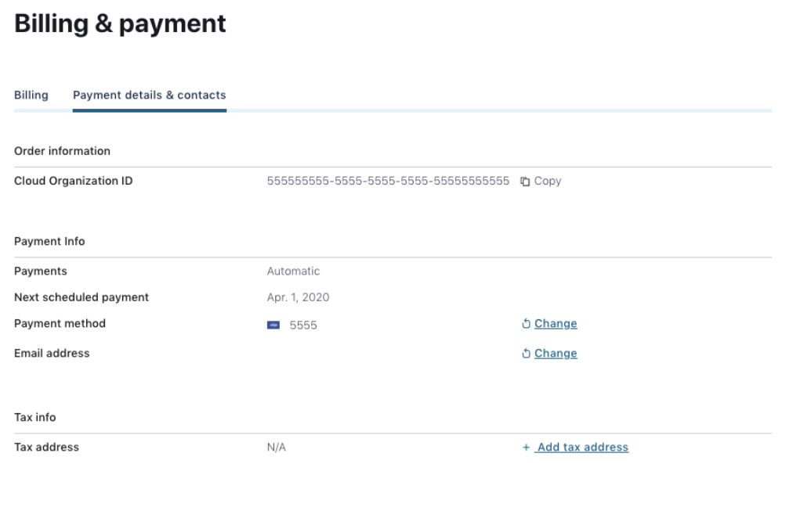

<br></br>
***
<br></br>

## **Objective**

<br>

Welcome to “Enable Real-Time Data Transformations and Stream Processing with ksqlDB”! In this workshop, we will learn how to build stream processing applications using ksqlDB as well as learn about the use cases ksqlDB unlocks: streaming ETL, data discovery and enrichment, anomaly detection, and more.

If you attended the first workshop in our Microservices Series, “Getting Started with Microservices in Confluent Cloud”, we walked through how to apply your microservices use case to the world of event streaming with Confluent Cloud. 

The second workshop in our series, “Seamlessly Connect Sources and Sinks to Confluent Cloud with Kafka Connect”, covered fully managed and self managed connectors. We walked through how to set up both types of connectors and this gave us the ability to connect our external systems to Confluent Cloud.

We have now established data flow to and from Confluent Cloud with the help of these two workshops. Now what if you want to instantly gain additional value and insight from your data within Kafka? You can use ksqlDB to create stream processing applications, all by using simple SQL statements. ksqlDB is available as fully managed within Confluent Cloud.

By the conclusion of the workshop, you will have learned how to leverage ksqlDB to perform continuous transformations, create materialized views, and serve lookups against these materialized views all with the data you already have in Confluent Cloud.

<br></br>
***
<br></br>


## <a name="step-1"></a>Log into Confluent Cloud

1. Log into [Confluent Cloud](https://confluent.cloud) and enter your email and password.

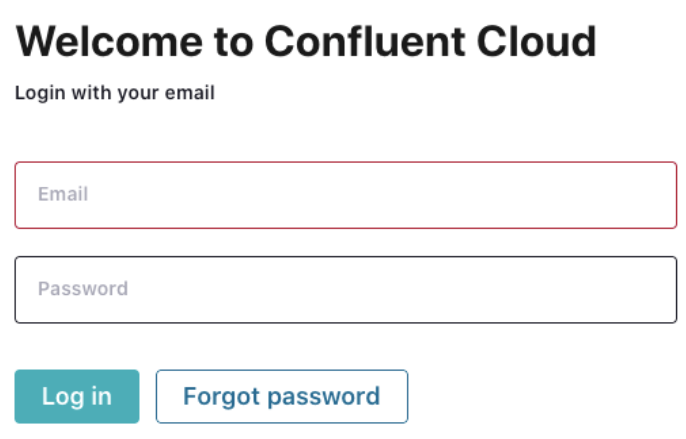

2. If you are logging in for the first time, you will see a self-guided wizard that walks you through spinning up a cluster. Please minimize this as we will walk through those steps in this workshop. 

<br></br>
***
<br></br>

## <a name="step-2"></a>Create an Environment and Kafka Cluster

An environment contains Kafka clusters and its deployed components such as Connectors, ksqlDB, and Schema Registry. You have the ability to create different environments based on your company's requirements. We’ve seen companies use environments to separate Development/Testing, Pre-Production, and Production clusters. 

1. Click **+ Add Environment**. Specify an **Environment Name** and Click **Create**. 

>**Note:** There is a *default* environment ready in your account upon account creation. You can use this *default* environment for the purpose of this workshop if you do not wish to create an additional environment.


2. Now that we have an environment, click **Create Cluster**. 

> **Note:** Confluent Cloud clusters are available in 3 types: Basic, Standard, and Dedicated. Basic is intended for development use cases so we will use that for the workshop. Basic clusters only support single zone availability. Standard and Dedicated clusters are intended for production use and support Multi-zone deployments. If you are interested in learning more about the different types of clusters and their associated features and limits, refer to this [documentation](https://docs.confluent.io/current/cloud/clusters/cluster-types.html).

3. Chose the **Basic** cluster type. 

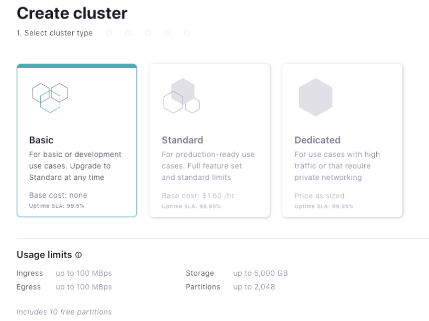

4. Click **Begin Configuration**. 
5. Choose your preferred Cloud Provider (AWS, GCP, or Azure), region, and availability zone. 
6. Specify a **Cluster Name**. For the purpose of this lab, any name will work here. 

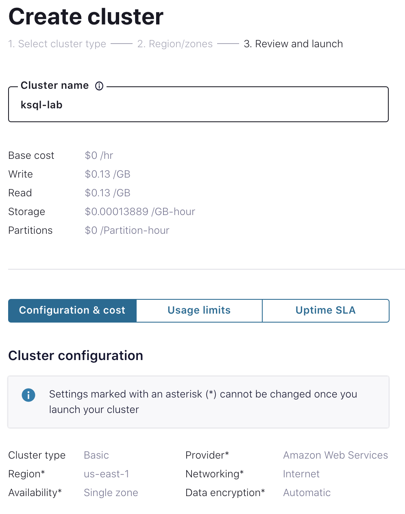

7. View the associated *Configuration & Cost*, *Usage Limits*, and *Uptime SLA* information before launching. 
8. Click **Launch Cluster**. 

<br></br>
***
<br></br>

## <a name="step-3"></a>Create a ksqlDB Application

1. On the navigation menu, select **ksqlDB** and click **Create Application Myself**. 
2. Select **Global Access** and then **Continue**.
3. Name you ksqlDB application and set the streaming units to **4**. Click **Launch Application!**

> **Note:** A streaming unit, also known as a Confluent Streaming Unit (CSU), is the unit of pricing for Confluent Cloud ksqlDB. A CSU is an abstract unit that represents the linearity of performance.


<br></br>
***
<br></br>

## <a name="step-4"></a>Creates Topic and Walk Through Cloud Dashboard

1. On the navigation menu, you will see **Cluster Overview**. 

> **Note:** This section shows Cluster Metrics, such as Throughput and Storage. This page also shows the number of Topics, Partitions, Connectors, and ksqlDB Applications.  Below is an example of the metrics dashboard once you have data flowing through Kafka. 

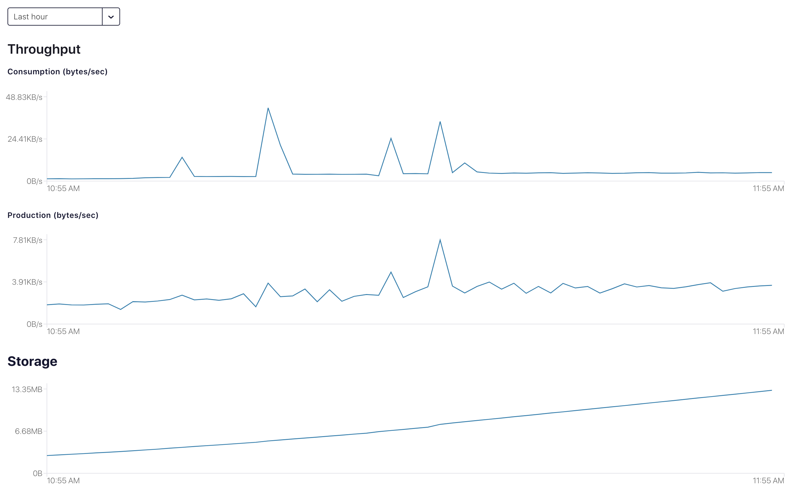

2. Click on **Cluster Settings**. This is where you can find your *Cluster ID, Bootstrap Server, Cloud Details, Cluster Type,* and *Capacity Limits*.
3. On the same navigation menu, select **Topics** and click **Create Topic**. 
4. Enter **users_topic** as the topic name, **1** as the number of partitions, and then click **Create with defaults**. 

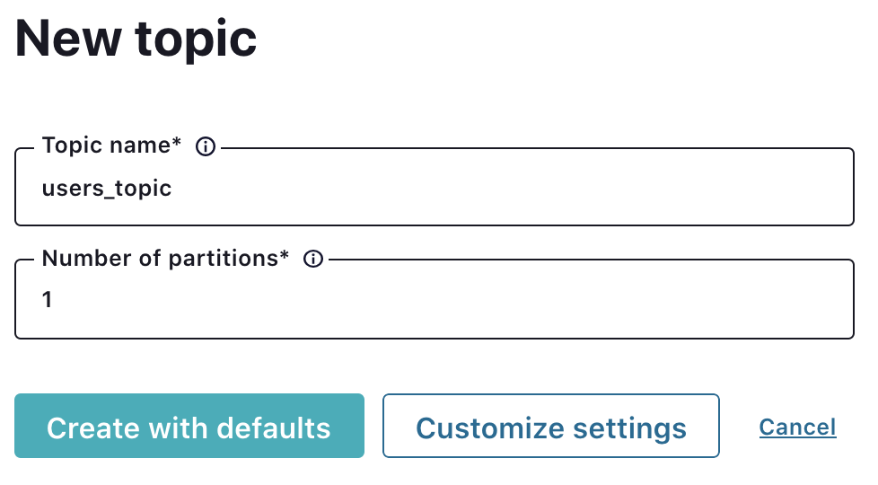

5. Repeat the previous step and create a second topic name **stocks_topic** and **1** as the number of partitions. 

> **Note:** Topics have many configurable parameters that dictate how Kafka handles messages. A complete list of those configurations for Confluent Cloud can be found [here](https://docs.confluent.io/cloud/current/using/broker-config.html). If you are interested in viewing the default configurations, you can view them in the Topic Summary on the right side. 

6. After topic creation, the **Topics UI** allows you to monitor production and consumption throughput metrics and the configuration parameters for your topics. When we begin sending messages to Confluent Cloud, you will be able to view those messages and message schemas.
7. Below is a look at our topic, **users_topic**, but we need to send data to this topic before we see any metrics.


<br></br>
***
<br></br>

## <a name="step-5"></a>Create an API Key Pair

1. Select **API Access** on the mavigation menu. 
2. A key pair has already been created for the ksqlDB application we created in *Step 3*. Select **+ Add Key** to create another key pair. 


3. Select **Global Access** and then click **Next**. 
4. Copy or save your API Key and Secret somewhere. We will need these later on in the lab. 

> **Note:** Once you close the dialogue, you won't be able to view your API Secret again. If you didn't save this somewhere in the previous step, remove the key and create it again this time saving the secret somewhere. 

5. After creating and saving the API key, you will see this API key in the Confluent Cloud UI in the **API Access** tab. If you don’t see the API key populate right away, refresh the browser.

<br></br>
***
<br></br> 

## <a name="step-6"></a>Create Datagen Connectors for Users and Stocks

The next step is to produce sample data using the Datagen Source connector. We will create two Datagen Source connectors. One connector will send sample user data to **users_topic** and the other connector will send sample stock data to **stocks_topic**.

1. First, we will create the connector that will send data to **users_topic**. From the Confluent Cloud UI, click on the **Connectors** tab on the navigation menu. Click on the **Datagen Source** icon.

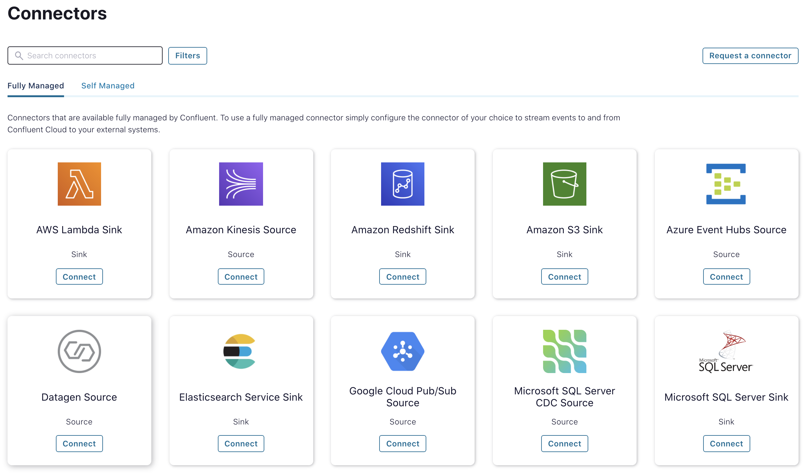

2. Enter the following configuration details. The remaining fields can be left blank.

| setting                            | value                        |
|------------------------------------|------------------------------|
| name                               | DatagenSourceConnector_Users |
| api key                            | [*from step 5* ](#step-5)    |
| api secret                         | [*from step 5* ](#step-5)    |
| topic                              | users_topic                  |
| output message format              | JSON                         |
| quickstart                         | USERS                        |
| max interval between messages (ms) | 1000                         |
| tasks                              | 1                            |

<br>

3. Click on **Next**.
4. Before launching the connector, you should see something similar to the following. If everything looks similar, select **Launch**. 

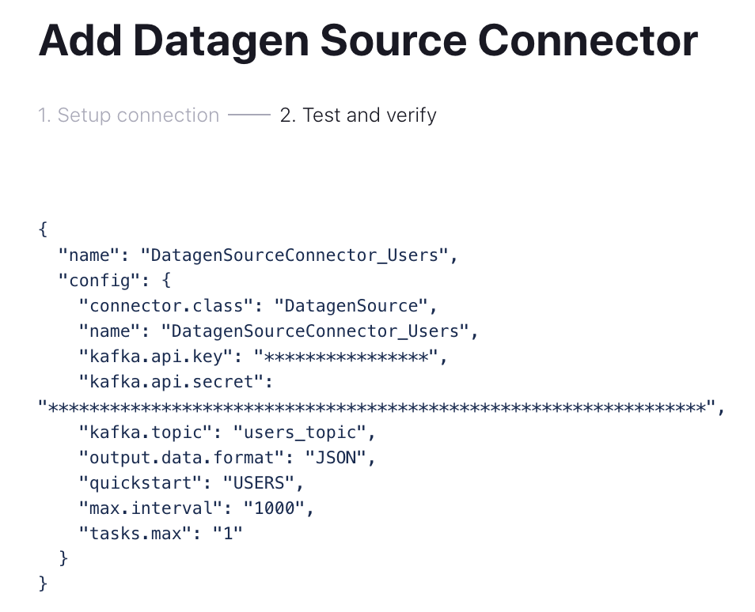

5. Next, we will create the second connector that will send data to **stocks_topic**. Click on **+ Add Connector** and then the **datagen Source** icon again. 

6. Enter the following configuration details. The remaining fields can be left blank. 

| setting                            | value                        |
|------------------------------------|------------------------------|
| name                               | DatagenSourceConnector_Stocks|
| api key                            | [*from step 5* ](#step-5)    |
| api secret                         | [*from step 5* ](#step-5)    |
| topic                              | stocks_topic                 |
| output message format              | JSON                         |
| quickstart                         | STOCKS                       |
| max interval between messages (ms) | 1000                         |
| tasks                              | 1                            |

<br> 

7. Review the output again and then select **Launch**.

> **Note:** It may take a few moments for the connectors to launch. Check the status and when both are ready, the status should show *running*. 
> 

> **Note:** If the connectors fails, there are a few different ways to troubleshoot the error:
> - Click on the *Connector Name*. You will see a play and pause button on this page. Click on the play button.
> - Click on the *Connector Name*, go to *Settings*, and re-enter your API key and secret. Double check there are no extra spaces at the beginning or end of the key and secret that you may have accidentally copied and pasted.
> - If neither of these steps work, try creating another Datagen connector.

9. We can view the sample data flowing into our topics in real time. Mavigate to  the **Topics** tab and then click on the **users_topic**. You can view the production and consumption throughput metrics here.


10. Click on **Messages**. In the search bar, select **Jump to Offset** from the drop-down, set the offset to **0**, and then execute the search. 
11. You should now be able to see the messages within the UI. Click on the *Card View* to see the messages in a different format. <br>  <br> The messages should look something like this: <br> 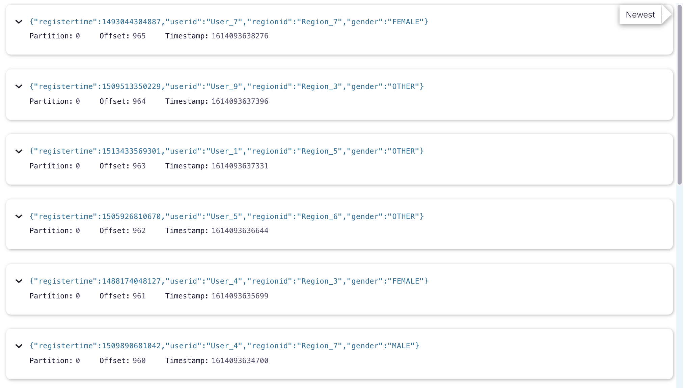

<br></br>
***
<br></br>

## <a name="step-7"></a>Create a Stream and a Table

Now that we are producing a continuous stream of data to our **users_topic** and **stocks_topic**, we will use ksqlDB to understand our data better by performing continuous transformations, masking certain fields, and creating new derived topics with the enriched data.

We will start by creating a stream and table, which will be the foundation for our transformations in the upcoming steps.

A *stream* provides immutable data. It supports only inserting (appending) new events, whereas existing events cannot be changed. Streams are persistent, durable, and fault tolerant. Events in a stream can be keyed.

A *table* provides mutable data. New events—rows—can be inserted, and existing rows can be updated and deleted. Like streams, tables are persistent, durable, and fault tolerant. A table behaves much like an RDBMS materialized view because it is being changed automatically as soon as any of its input streams or tables change, rather than letting you directly run insert, update, or delete operations against it.

To learn more about *streams* and *tables* we recommend the following resources:
- [Streams and Talbes in Apache Kafka: A Primer](https://www.confluent.io/blog/kafka-streams-tables-part-1-event-streaming/)
- [ksqlDB: Data Definition](https://docs.ksqldb.io/en/latest/reference/sql/data-definition/)

<br>

1. Navigate back to the **ksqlDB** tab and click on your application name. This will bring us to the ksqlDB editor. 

> **Note:** We can interact with ksqlDB through the **Editor**. You can create a stream by using the `CREATE STREAM` statement and a table using the `CREATE TABLE` statement. <br><br>To write streaming queries against **users_topic** and **stocks_topic**, we will need to register the topics with ksqlDB as a stream and/or table. 

2. First, let's create a **Stream** by registering the **stocks_topic** as a stream called **stocks_stream**. 

```sql
CREATE STREAM stocks_stream (
    side varchar, 
    quantity int, 
    symbol varchar, 
    price int, 
    account varchar, 
    userid varchar
) 
WITH (kafka_topic='stocks_topic', value_format='JSON');
```

3. Next, go to the **Streams** tab at the topic and clock on **STOCKS_STREAM**. This provides information on the stream, topic (including replication, partitions, and key and value serialization), and schemas.

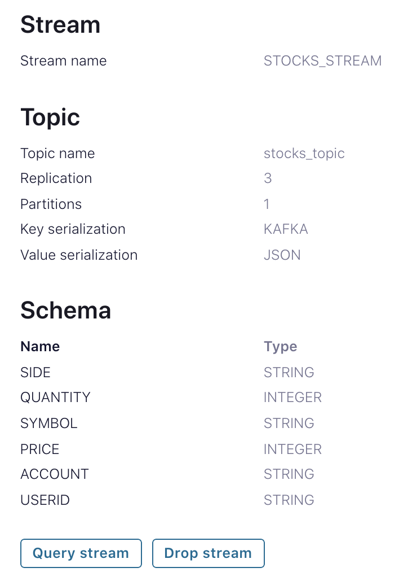

4. Click on **Query Stream** which will take you back to the **Editor**. You will see the following query auto-populated in the editor which may be already running by default. If not, click on **Run query**. An option is to set the `auto.offset.reset=earliest` before clicking **Run query**.


5. You should see the following data within your **STOCKS_STREAM** stream.


6. Click **Stop**. 
7. Next, let's create a **Table** by registering the **users_topic** as a table named **users**. Copy the following code into the **Editor** and click **Run**. 

```sql
CREATE TABLE users (
    userid varchar PRIMARY KEY, 
    registertime bigint, 
    gender varchar, 
    regionid varchar
) 
WITH (KAFKA_TOPIC='users_topic', VALUE_FORMAT='JSON');
```

8. Once you have created the **USERS** table, let’s repeat what we did above with **STOCKS_STREAMS** and query our **USERS** table. This time, select the **Tables** tab and then select the **USERS** table. You can also set the `auto.offset.reset=earliest`.


9. You should see the following data in the messages output.

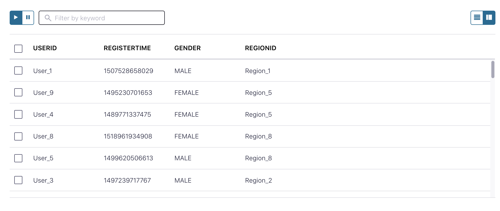

> **Note:** Note: If the output does not show up immediately, you may have done everything correctly and it just needs a moment. Setting `auto.offset.reset=earliest` also helps output data faster since the messages are already in the topics.

10. Stop the query by clicking **Stop**. 

<br></br>
***
<br></br>

## <a name="step-10"></a>Create a Persistent Query

A *Persistent Query* runs indefinitely as it processes rows of events and writes to a new topic. You can create persistent queries by deriving new streams and new tables from existing streams or tables.

1. We will now create a **Persistent Query** named **stocks_enriched** by left joining our stream (**STOCKS_STREAM**) and table (**USERS**). Navigate to the **Editor** and paste the following command.

```sql
CREATE STREAM stocks_enriched AS
    SELECT users.userid AS userid, 
           regionid, 
           gender, 
           side, 
           quantity, 
           symbol, 
           price, 
           account
    FROM stocks_stream
    LEFT JOIN users
    ON stocks_stream.userid = users.userid
EMIT CHANGES;
```

2. Using the **Editor**, query the new stream. You can either type in a select statement or you can navigate to the stream and select the query button, similar to how we did it in a previous step. You can also choose to set `auto.offset.reset=earliest`. <br><br>The output from the select statement should be similar to the following: <br>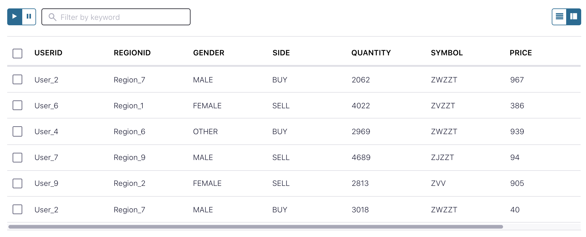<br>Note that we have a stream of records from the left join of our **USERS** table and **STOCKS_STREAM** stream we can view the relationship between user and trades in real-time.

4. Next, let’s take a look at the topic created when we created the persistent query with the left join. Navigate to the **Topics** tab on the left hand menu and then select the topic prefixed with a unique ID followed by **STOCKS_ENRICHED**. It should resemble **pksqlc-xxxxxSTOCKS_ENRICHED**. Note this topic name as we will need it in a later step.<br>

5. Navigate to **Consumers** on the left hand menu and find the group that corresponds with your **STOCKS_ENRICHED** stream. See the screenshot below as an example. This view shows how well your persistent query is keeping up with the incoming data. You can monitor the consumer lag, current and end offsets, and which topics it is consuming from.<br>

<br></br>
***
<br></br>

## <a name="step-9"></a>Aggregate Data

ksqlDB supports several aggregate functions, like `COUNT` and `SUM`, and you can use these to build stateful aggregates on streaming data. In this step, we will walk through some key examples on different ways you can aggregate your data.

1. First, let’s do some aggregation of the data by counting buys and sells of our stocks. Navigate back to the Editor and paste the following query to create a new table named **number_of_times_stock_bought**.

```sql
CREATE TABLE number_of_times_stock_bought AS
    SELECT SYMBOL,
           COUNT(QUANTITY) AS total_times_bought
    FROM STOCKS_STREAM
    WHERE side = 'BUY'
    GROUP BY SYMBOL
EMIT CHANGES;
```
2. Next, query this table by going to the **Tables** tab and selecting the query option or typing it directly into the **Editor**. You can also choose to set `auto.offset.reset=earliest`.<br>

3. Next, let’s create a table that calculates the total number of stocks purchased per symbol. You can choose to set `auto.offset.reset=earliest`.<br>
```sql
CREATE TABLE total_stock_purchased AS
    SELECT symbol,
           SUM(QUANTITY) AS TOTAL_QUANTITY
    FROM STOCKS_ENRICHED
	WHERE SIDE = 'BUY'
    GROUP BY SYMBOL;
```
Running this query should return something that looks similar to the following.


<br></br>
***
<br></br>

## <a name="step-10"></a> Windowing Operations and Fraud Detection

We will walk through a few examples on how to use ksqlDB for Windowing, including how to use it for anomaly or fraud detection. ksqlDB enables aggregation operations on streams and tables, as we saw in the previous step, and you have the ability to set time boundaries named windows. A window has a start time and an end time, which you access in your queries by using `WINDOWSTART` and `WINDOWEND`. When using Windowing, aggregate functions are applied only to the records that occur within the specified time window. ksqlDB tracks windows per record key.

There are a few different Windowing operations you can use with ksqlDB. You can learn more about them [here](https://docs.ksqldb.io/en/latest/concepts/time-and-windows-in-ksqldb-queries/#window-types).

1. In the ksqlDB **Editor**, paste the following command in order to create a windowed table named **stocks_purchased_today** from the stocks_topic. You can set the size of the window to any duration. We will set it to 5 minutes in this example.

```sql
CREATE TABLE stocks_purchased_today
WITH (kafka_topic='stocks_topic') AS
    SELECT symbol,
           COUNT(*) AS quantity,
           WINDOWSTART AS window_start,
           WINDOWEND AS window_end
    FROM stocks_enriched
    WINDOW TUMBLING (SIZE 5 MINUTES)
    GROUP BY symbol;
```

2. Once you have created the windowed table, use the **Editor** or the **Tables** tab to query the table. The output should be similar to the following.<br>

3. Going along with the theme of fraud detection, let’s now create a table named **accounts_to_monitor** with accounts we want to monitor based on their activity during a given time frame. In the ksqlDB **Editor**, paste the following statement and run the query.

> **Note:** Change the topic name in the 2nd line to include your unique topic name we noted in [*Step 8*](#step-8). It should resemble **pksqlc-xxxxxSTOCKS_ENRICHED**.

```sql
CREATE TABLE accounts_to_monitor
WITH (kafka_topic='pksqlc-xxxxxSTOCKS_ENRICHED', partitions=1, value_format='JSON') AS
    SELECT TIMESTAMPTOSTRING(WINDOWSTART, 'yyyy-MM-dd HH:mm:ss Z') AS WINDOW_START,
           TIMESTAMPTOSTRING(WINDOWEND, 'yyyy-MM-dd HH:mm:ss Z') AS WINDOW_END,
           ACCOUNT
    FROM STOCKS_ENRICHED
    WINDOW TUMBLING (SIZE 2 HOURS)
    GROUP BY ACCOUNT
    HAVING COUNT(*) > 3;
```

4. Once you have created the **ACCOUNTS_TO_MONITOR** table, use either the **Editor** or the **Tables** tab to query the data from the table. The output should be similar to the following. <br>

<br></br>
***
<br></br>

## <a name="step-11"></a>Data Masking

In this last step, we will learn how we can use ksqlDB to mask data that may contain sensitive information and is often applicable to use cases that have PII data.

1. To demonstrate data masking, let’s create a new stream named **accounts_masking**. We will persist the events in the original topic to a new Kafka topic with the **account** field within our data set removed. Copy the following statement and run it in the **Editor**. 

```sql
CREATE STREAM accounts_masking
WITH (kafka_topic='masking_stocks_topic', value_format='json', partitions=1) AS
    SELECT MASK(ACCOUNT) AS ACCOUNT,
  	       USERID, 
           SIDE, 
           QUANTITY, 
           SYMBOL, 
           PRICE
    FROM STOCKS_STREAM;
```

2. Next, query the newly create stream using either the **Editor** or the **streams** tab. The output should be similar to the following. <br> 

<br></br>
***
<br></br>

## <a name="step-12"></a>Clean Up Resources

Deleting the resources you created during this workshop will prevent you from incurring additional charges.

1. The first item we should delete is our ksqlDB application. Select the **Delete** button under **Actions** and enter the **Application Name** to confirm the deletion. <br> 

2. Next, we can delete the Datagen Source connectors for **users** and **stocks**. Navigate to the **Connectors** tab and select each connector. In the top right corner, you will see a **trash** icon. Click the icon and enter the **Connector Name**. Delete both the **users** and **stocks** connectors. <br> 

3. Finally, under **Cluster Settings** we can select the **Delete Cluster** button at the bottom. Enter the **Cluster Name** and select **Confirm**. 

<br></br>
***
<br></br> 

## <a name="step-13"></a>Confluent Resources and Further Testing

Here are some links to check out if your interested in further testing:
- [ksqlDB Tutorials](https://kafka-tutorials.confluent.io/)
- [ksqlDB: The Event Streaming Database, Purpose-Build for Stream Processing](https://ksqldb.io/)
- [Streams and Tables in Apache Kafka: A Primer](https://www.confluent.io/blog/kafka-streams-tables-part-1-event-streaming/)
- [Confluent Cloud Documentation](https://docs.confluent.io/cloud/current/overview.html)
- [Best Practices for Developing Apache Kafka Applications on Confluent Cloud](https://assets.confluent.io/m/14397e757459a58d/original/20200205-WP-Best_Practices_for_Developing_Apache_Kafka_Applications_on_Confluent_Cloud.pdf)